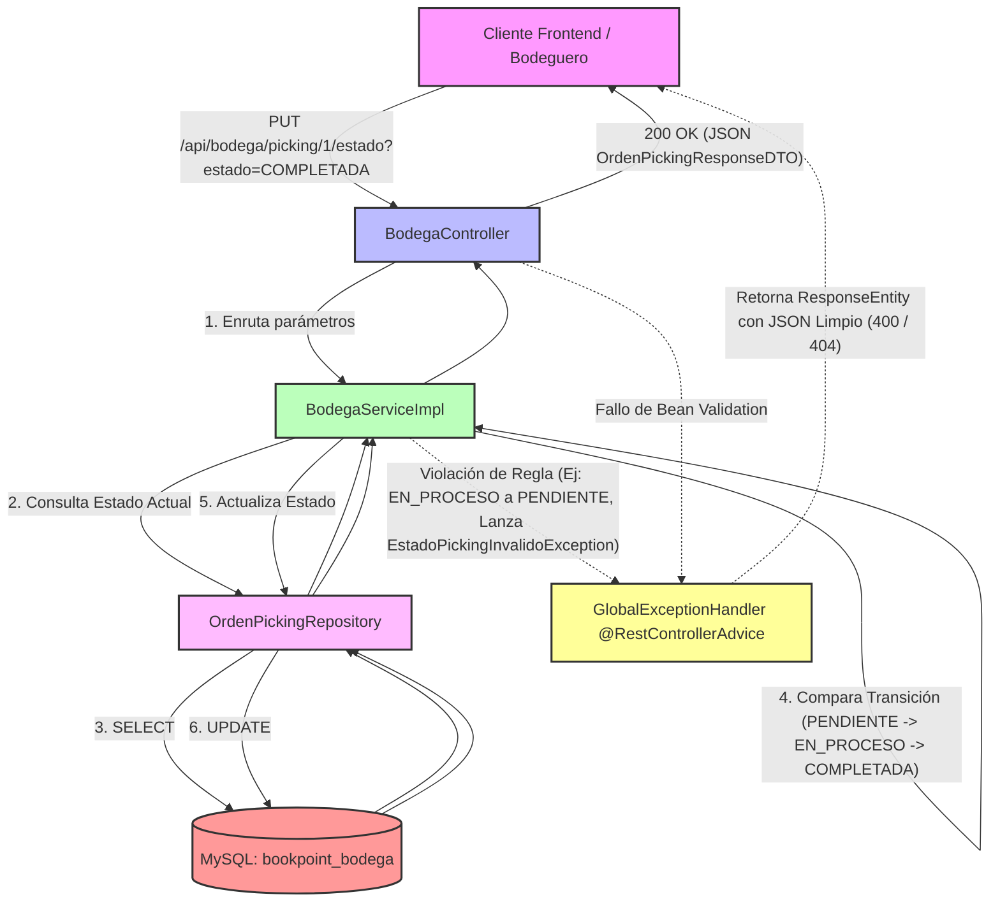

# Microservicio ms-bodega - BookPoint Chile
> **Área:** Gestión de Almacén, Ubicaciones Físicas y Órdenes de Picking  
> **Arquitectura:** Microservicios con Spring Boot (Java 17) bajo Patrón CSR  
> **Puerto por Defecto:** `8089`

---

## 1. Visión General y Responsabilidades

El microservicio **`ms-bodega`** es responsable del control logístico interno, el ordenamiento físico y el armado de pedidos en los almacenes centrales y sucursales de **BookPoint Chile**. Su foco principal es optimizar el flujo físico de los libros y artículos desde su almacenamiento hasta el despacho al cliente final.

### Reglas de Negocio y Responsabilidades Críticas:
*   **Gestión de Almacenamiento Estructurado:** Administra la cuadrícula de ubicaciones físicas de los almacenes dividida de forma tridimensional por **Pasillos**, **Estantes** y **Niveles**, asociándolos a un código de barras único para automatizar el inventario mediante lectores de radiofrecuencia.
*   **Órdenes de Picking (Armado de Pedidos):** Gobierna el proceso en el que un operario de bodega camina físicamente por el almacén colectando productos para consolidar la caja de un cliente. Para evitar duplicidades operativas, una venta (`ventaId`) solo puede tener asignada una orden de picking activa en todo el sistema.
*   **Máquina de Estados Estricta (Service Layer):** Controla el ciclo de vida del picking a través de tres estados secuenciales e inmutables:
    `PENDIENTE` ➔ `EN_PROCESO` ➔ `COMPLETADA`
    El sistema prohíbe saltos lógicos (ej: pasar de PENDIENTE a COMPLETADA directamente sin transicionar por EN_PROCESO) y protege las órdenes finalizadas (`COMPLETADA`), bloqueando cualquier intento de re-procesamiento o retroceso de estado.

---

## 2. Diagrama de Estructura y Máquina de Estados (Mermaid)

El siguiente diagrama detalla la arquitectura del microservicio bajo el patrón CSR, ilustrando el flujo de control, la máquina de estados contenida en el Service, y la captura centralizada de excepciones comerciales:



---

## 3. Tecnologías Core e Implementación Técnica

*   **Spring Boot 3.2.5:** Motor principal para el desarrollo de APIs REST desacopladas.
*   **Spring Data JPA (Hibernate):** Persistencia relacional avanzada para el modelamiento de las entidades `UbicacionFisica` y `OrdenPicking`.
*   **Integración e Integridad de Datos:** Forzado de claves únicas relacionales con `@Column(unique = true)` para evitar duplicidad de códigos de barra y doble picking por venta.
*   **JSR 380 (Bean Validation 3.0):** Emplea anotaciones en los DTOs de entrada para robustecer el sistema:
    *   `@NotBlank` en pasillo, estante, nivel y operario.
    *   `@NotNull` en `ventaId` para asegurar enlaces referenciales limpios en transacciones distribuidas.
*   **SLF4J (Logback):** Logger mediante `@Slf4j` en la capa de servicios para registrar auditoría operativa (`log.info` al iniciar el picking) y alertas de seguridad (`log.warn` en intentos de alteración de estados).

---

## 4. Documentación de Endpoints REST

La API se encuentra completamente adaptada con CORS habilitado (`@CrossOrigin`) para la integración CSR y la interoperabilidad en tiempo real:

| Método HTTP | Endpoint | Descripción | Códigos HTTP de Respuesta |
| :--- | :--- | :--- | :--- |
| **POST** | `/api/bodega/ubicaciones` | Registra una nueva ubicación física o celda de almacenamiento en la bodega. | `201 Created` (Éxito)<br>`400 Bad Request` (Campos vacíos o código de barras duplicado) |
| **POST** | `/api/bodega/picking` | Crea una nueva orden de picking para consolidar los artículos de una venta (`ventaId`). | `201 Created` (Asignada)<br>`400 Bad Request` (Campos nulos o venta ya con picking) |
| **PUT** | `/api/bodega/picking/{id}/estado` | **(Endpoint Core)** Actualiza el estado del picking (`estado` por QueryParam: `PENDIENTE`, `EN_PROCESO`, `COMPLETADA`). | `200 OK` (Transición Exitosa)<br>`400 Bad Request` (Transición inválida o máquina de estados rota)<br>`404 Not Found` (Orden no existe) |

---

## 5. Pruebas de Integración (Postman Payloads)

### ✅ Happy Path: Creación Exitosa de una Orden de Picking
*   **Método:** `POST`
*   **URL:** `http://localhost:8089/api/bodega/picking`
*   **Body (JSON Raw):**
```json
{
  "ventaId": 9099,
  "operarioAsignado": "Carlos Soto (Supervisor de Bodega)"
}
```
*   **Respuesta Esperada (201 Created):**
```json
{
  "id": 2,
  "ventaId": 9099,
  "operarioAsignado": "Carlos Soto (Carlos Soto (Supervisor de Bodega))",
  "estado": "PENDIENTE",
  "fechaAsignacion": "2026-05-24T19:18:24.123456"
}
```

---

### ❌ Flujo de Error: Transición Inválida de Estado (400 Bad Request)
*   **Método:** `PUT`
*   **URL:** `http://localhost:8089/api/bodega/picking/1/estado?estado=PENDIENTE`
*   **Explicación:** La orden de picking con ID `1` fue sembrada automáticamente por `DataInitializer.java` en estado **PENDIENTE** y asignada a *Juan Pérez*. Mediante solicitudes previas, supongamos que el bodeguero completó la orden (`COMPLETADA`). Si se intenta volver a setear el estado a `PENDIENTE` (lo cual es una violación directa a la máquina de estados inmutable), el Service rechaza la transacción, emite un `log.warn` en consola y el `@RestControllerAdvice` responde con el código **HTTP 400 Bad Request**:

*   **Respuesta Esperada (400 Bad Request):**
```json
{
  "timestamp": "2026-05-24T19:22:15.987654",
  "status": 400,
  "error": "Bad Request - State Machine Violation",
  "message": "La orden de picking ya se encuentra en estado COMPLETADA y no admite más cambios de estado.",
  "path": "/api/bodega/picking/1/estado",
  "details": null
}
```

---

## 6. Instrucciones de Ejecución

### Requisitos Previos:
1.  **Java JDK 17** instalado y configurado.
2.  **Apache Maven 3.8+** instalado.
3.  **MySQL Server** configurado y en ejecución.

### Configuración del Entorno:
1.  Crea la base de datos `bookpoint_bodega` en tu servidor MySQL:
    ```sql
    CREATE DATABASE bookpoint_bodega;
    ```
2.  Verifica las credenciales en [application.properties](src/main/resources/application.properties):
    ```properties
    spring.datasource.url=jdbc:mysql://localhost:3306/bookpoint_bodega?createDatabaseIfNotExist=true&useSSL=false&serverTimezone=UTC
    spring.datasource.username=root
    spring.datasource.password=tu_contraseña
    ```

### Sembrado Automático (Boot Seeder):
Al arrancar, el microservicio ejecuta `DataInitializer.java` e inyecta:
1.  **Tres ubicaciones físicas semilla:** Pasillo A (Estante 1, Nivel 2), Pasillo B (Estante 3, Nivel 1) y Pasillo C (Estante 2, Nivel 3).
2.  **Una orden de picking semilla:** Asociada a la venta ficticia `5001` asignada a *Juan Pérez* en estado **PENDIENTE** para testear inmediatamente las transacciones.

### Ejecutar el Microservicio:
Abre una terminal en la raíz de `ms-bodega` y ejecuta:

```bash
mvn clean spring-boot:run
```

El microservicio levantará correctamente en el puerto **`8089`**, gobernando las órdenes de picking y logística del almacén.
