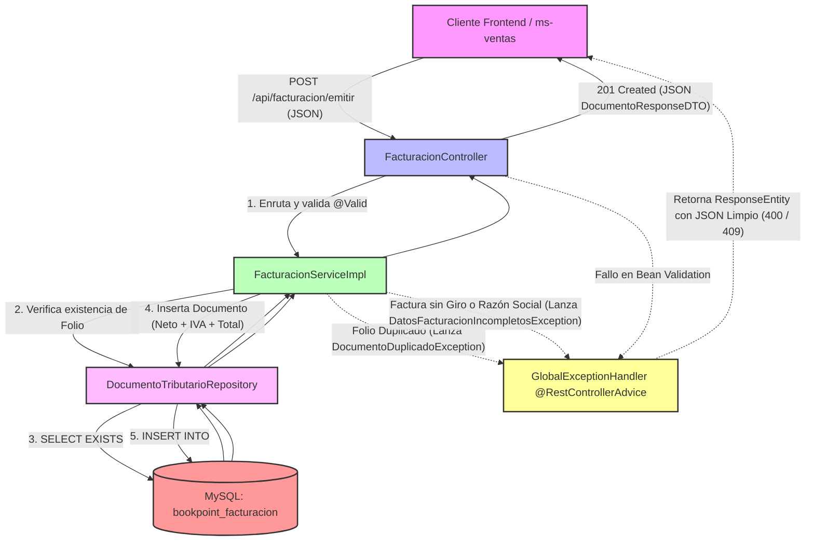

# Microservicio ms-facturacion - BookPoint Chile
> **Área:** Motor Tributario, Emisión de Boletas y Facturas  
> **Arquitectura:** Microservicios con Spring Boot (Java 17) bajo Patrón CSR  
> **Puerto por Defecto:** `8088`

---

## 1. Visión General y Responsabilidades

El microservicio **`ms-facturacion`** constituye el núcleo fiscal y motor tributario de la plataforma **BookPoint Chile**. Su función primaria es automatizar el proceso de facturación de transacciones de ventas (tanto físicas en sucursal como compras online) y emitir los correspondientes documentos tributarios de acuerdo con la legislación tributaria vigente de Chile.

### Reglas de Negocio y Responsabilidades Críticas:
*   **Emisión Dual de Documentos:** Soporta la emisión de dos tipos de documentos tributarios según las necesidades del receptor:
    *   **BOLETA:** Emitida a consumidores finales.
    *   **FACTURA:** Diseñada para transacciones comerciales B2B. Exige de forma estricta la provisión de **Razón Social** y **Giro** comercial.
*   **Precisión Financiera (IVA 19%):** A partir del *Monto Neto* suministrado, el `Service` calcula matemáticamente el **IVA** aplicando la tasa impositiva exacta del **19%** establecida por el Servicio de Impuestos Internos (SII) de Chile. Los valores se redondean a pesos chilenos enteros para reflejar la realidad del sistema tributario nacional.
*   **Control de Unicidad Fiscal (No Doble Facturación):** Garantiza que una misma transacción de venta no sea facturada en más de una ocasión, forzando una restricción de unicidad estricta sobre la columna `folioVenta`. Cualquier intento de facturar un folio ya procesado gatilla inmediatamente una excepción controlada.

---

## 2. Diagrama de Estructura e Intercepción de Errores (Mermaid)

El siguiente flujo ilustra el ciclo de vida completo del proceso de facturación, desde el envío de los datos en formato JSON (patrón CSR) hasta la persistencia en base de datos MySQL, demostrando la intercepción de errores en la capa de control:



---

## 3. Tecnologías Core e Implementación Técnica

*   **Spring Boot 3.2.5:** Plataforma central para el diseño y exposición de microservicios RESTful rápidos y modulares.
*   **Spring Data JPA (Hibernate):** Abstracción de acceso a datos que permite la persistencia limpia y transaccional en el motor MySQL.
*   **Consistencia Relacional de Unicidad:** Implementada mediante `@Column(unique = true, nullable = false)` en el atributo `folioVenta` de la entidad `DocumentoTributario` para evitar duplicación.
*   **JSR 380 (Bean Validation 3.0):** Aplica validación estricta de parámetros de entrada a nivel del `EmitirDocumentoRequestDTO`:
    *   `@NotBlank` en `folioVenta` y `rutCliente` para rechazar campos vacíos.
    *   `@NotNull` y `@Positive` en `montoNeto` para asegurar que los cálculos se realicen sobre montos financieros válidos.
*   **SLF4J (Logback):** Logger inyectado mediante `@Slf4j` en la capa de servicios para registrar auditoría operativa (`log.info` en emisiones exitosas) y alertar sobre anomalías fiscales (`log.warn` ante intentos de duplicidad o datos incompletos).

---

## 4. Documentación de Endpoints REST

La API cuenta con el soporte de CORS habilitado (`@CrossOrigin`) para integrarse dinámicamente en aplicaciones Web CSR:

| Método HTTP | Endpoint | Descripción | Códigos HTTP de Respuesta |
| :--- | :--- | :--- | :--- |
| **POST** | `/api/facturacion/emitir` | Procesa y emite un documento tributario (Boleta o Factura), calculando automáticamente el 19% de IVA y el Total. | `201 Created` (Éxito de Emisión)<br>`400 Bad Request` (Faltan campos, monto inválido, o Factura sin Razón/Giro)<br>`409 Conflict` (Folio ya facturado) |
| **GET** | `/api/facturacion/venta/{folioVenta}` | Recupera la boleta o factura emitida asociada al folio de la venta. | `200 OK` (Encontrado)<br>`404 Not Found` (El folio de venta no tiene ningún documento emitido) |
| **GET** | `/api/facturacion` | Obtiene un listado completo de todos los documentos emitidos (Genial para auditorías internas). | `200 OK` (Éxito) |

---

## 5. Pruebas de Integración (Postman Payloads)

### ✅ Happy Path: Emisión Exitosa de una FACTURA (B2B)
*   **Método:** `POST`
*   **URL:** `http://localhost:8088/api/facturacion/emitir`
*   **Body (JSON Raw):**
```json
{
  "folioVenta": "V-2026-9999",
  "rutCliente": "76.123.456-7",
  "razonSocial": "DISTRIBUIDORA Y LIBRERIA LECTOR SPB",
  "giro": "VENTA DE LIBROS Y PAPELERIA",
  "tipoDocumento": "FACTURA",
  "montoNeto": 50000.0
}
```
*   **Respuesta Esperada (201 Created):**
```json
{
  "id": 3,
  "folioVenta": "V-2026-9999",
  "rutCliente": "76.123.456-7",
  "razonSocial": "DISTRIBUIDORA Y LIBRERIA LECTOR SPB",
  "giro": "VENTA DE LIBROS Y PAPELERIA",
  "tipoDocumento": "FACTURA",
  "montoNeto": 50000.0,
  "montoIva": 9500.0,
  "montoTotal": 59500.0,
  "fechaEmision": "2026-05-24T19:08:42.123456"
}
```

---

### ❌ Flujo de Error: Intento de Doble Emisión (409 Conflict)
*   **Método:** `POST`
*   **URL:** `http://localhost:8088/api/facturacion/emitir`
*   **Body (JSON Raw):**
```json
{
  "folioVenta": "V-2026-0001",
  "rutCliente": "19.876.543-K",
  "tipoDocumento": "BOLETA",
  "montoNeto": 10000.0
}
```
*   **Explicación:** El folio `V-2026-0001` ya fue sembrado en la base de datos por `DataInitializer.java` al arrancar. Al re-enviarlo, el servicio rechaza la transacción y el `@RestControllerAdvice` responde con HTTP **409 Conflict**:
*   **Respuesta Esperada (409 Conflict):**
```json
{
  "timestamp": "2026-05-24T19:10:15.987654",
  "status": 409,
  "error": "Conflict - Fiscal Duplicate",
  "message": "El folio de venta 'V-2026-0001' ya tiene un documento tributario emitido.",
  "path": "/api/facturacion/emitir",
  "details": null
}
```

---

## 6. Instrucciones de Ejecución

### Requisitos Previos:
1.  **Java JDK 17** instalado y configurado en tus variables de entorno.
2.  **Apache Maven 3.8+** instalado.
3.  **MySQL Server** corriendo localmente.

### Configuración de la Base de Datos:
1.  Inicia tu cliente MySQL y crea un esquema vacío llamado `bookpoint_facturacion`:
    ```sql
    CREATE DATABASE bookpoint_facturacion;
    ```
2.  Comprueba las credenciales en tu archivo `application.properties` local:
    ```properties
    spring.datasource.url=jdbc:mysql://localhost:3306/bookpoint_facturacion?createDatabaseIfNotExist=true&useSSL=false&serverTimezone=UTC
    spring.datasource.username=root
    spring.datasource.password=tu_contraseña
    ```

### Sembrado Automático (Boot Seeder):
El microservicio cuenta con un cargador automático (`DataInitializer.java`). Si la base de datos está vacía, inyectará inmediatamente:
1.  Una **Boleta** semilla para el folio `V-2026-0001` (Neto: $10,000 | IVA: $1,900 | Total: $11,900).
2.  Una **Factura** semilla para el folio `V-2026-0002` (Neto: $150,000 | IVA: $28,500 | Total: $178,500) asociada a "EDITORIAL ALFA S.A."

### Levantar el Microservicio:
Desde una consola posicionada en la raíz del microservicio `ms-facturacion` , ejecuta:

```bash
mvn clean spring-boot:run
```

El servidor iniciará en el puerto **`8088`**, quedando a la escucha de peticiones de facturación.
