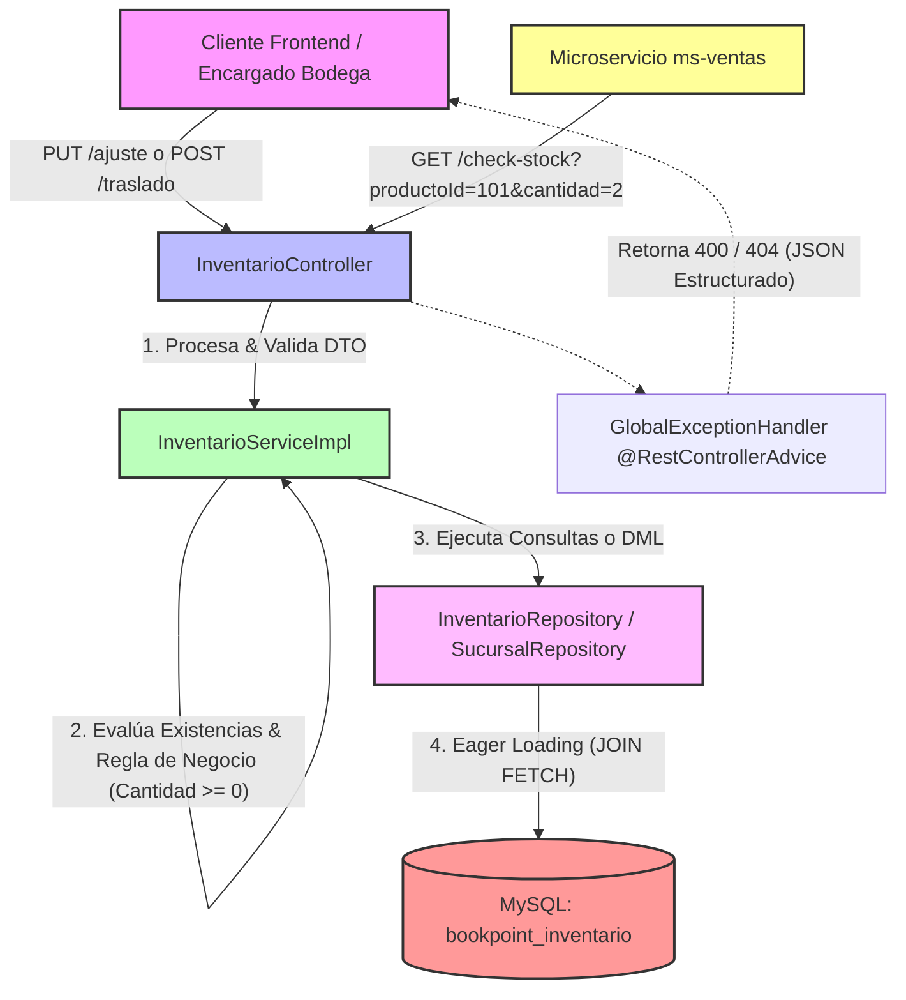

# Microservicio ms-inventario - BookPoint Chile
> **Área:** Control de Stock, Sucursales y Logística Interna  
> **Arquitectura:** Microservicios con Spring Boot (Java 17) bajo Patrón CSR  
> **Puerto por Defecto:** `8082`

---

## 1. Visión General y Responsabilidades

El microservicio **`ms-inventario`** representa el corazón de la disponibilidad física de productos de **BookPoint Chile**. Control en tiempo real para el control de stock, gestionando la mercadería distribuida en la red de sucursales geográficas de la librería:
*   **Bodega Central Concepción** (Centro de recepción B2B e importaciones).
*   **Sucursal Temuco** (Punto de venta y distribución sur).
*   **Sucursal La Serena** (Punto de venta y distribución norte).

### Reglas de Negocio Críticas Controladas en la Capa Service:
1.  **Integridad de Datos Física:** No se permite ninguna operación (ajuste manual o traslado) que deje el stock de un producto en un valor negativo (`cantidad < 0`).
2.  **Restricción Única de Distribución:** Un producto puede existir en múltiples sucursales, pero a nivel físico y relacional se aplica un índice único estricto para evitar duplicidad de registros del mismo artículo por sucursal.
3.  **Monitoreo de Quiebres y Alertas:** Calcula dinámicamente si el stock actual de un artículo ha caído por debajo de su umbral mínimo configurado (`cantidad <= stockMinimo`), marcando el flag `alertaReposicion = true` de forma automática para el **Jefe de Sucursal**.
4.  **Interoperabilidad Crítica (Feign Entrypoint):** Expone un canal síncrono ultra-rápido (`/api/inventario/check-stock`) utilizado de forma obligatoria por `ms-ventas` antes de facturar, validando y asegurando existencias en el sistema de ventas presenciales u online.

---

## 2. Diagrama de Arquitectura y Flujo (CSR Pattern)

A continuación, se detalla el flujo de datos bajo el **patrón CSR**. Se muestra la integración del flujo entrante desde `ms-ventas` y las operaciones del **Encargado de Bodega**:



---

## 3. Tecnologías Core e Implementación Técnica

El desarrollo cuenta con herramientas robustas que optimizan la gestión de transacciones del inventario:

*   **Spring Boot 3.2.5:** Framework principal del ecosistema del microservicio.
*   **Spring Data JPA (Hibernate):** Gestiona la consistencia relacional. Implementa una relación `@ManyToOne` entre `Inventario` y `Sucursal` con carga perezosa (`FetchType.LAZY`) para optimizar el consumo de CPU y red en consultas masivas.
*   **Unique Constraints Relacionales:** Define la regla `@UniqueConstraint(columnNames = {"producto_id", "sucursal_id"})` para garantizar que la tupla sea única a nivel físico en la base de datos MySQL.
*   **Evitar N+1 mediante JPQL Fetch:** Implementa la consulta personalizada `@Query("SELECT i FROM Inventario i JOIN FETCH i.sucursal WHERE i.cantidad <= i.stockMinimo")` en `InventarioRepository` para precargar de manera atómica las sucursales de cada alerta en un único viaje de red.
*   **JSR 380 (Bean Validation 3.0):** Anotaciones de control en DTOs como `@Min(1)` en traslados para impedir cantidades inválidas en las peticiones HTTP.
*   **SLF4J (Logback) & Trazabilidad:** Uso de `@Slf4j` en la capa de servicios para auditar ajustes de stock manuales, traslados entre sucursales y alertas disparadas de forma síncrona.

---

## 4. Documentación de Endpoints REST

| Método HTTP | Endpoint | Descripción | Códigos HTTP de Respuesta |
| :--- | :--- | :--- | :--- |
| **GET** | `/api/inventario/check-stock` | **(Feign Entrypoint)** Valida si existe stock centralizado suficiente para autorizar una venta de `ms-ventas`. | `200 OK` (Éxito) |
| **PUT** | `/api/inventario/ajuste` | Utilizado por el Encargado de Bodega tras auditorías físicas. Permite ajustes manuales hacia arriba o hacia abajo. | `200 OK` (Ajuste exitoso)<br>`400 Bad Request` (Resta excesiva de stock, datos inválidos)<br>`404 Not Found` (Sucursal no existe) |
| **POST** | `/api/inventario/traslado` | Realiza traslados seguros de stock entre sucursales (origen -> destino), validando stock en origen. | `201 Created` (Éxito)<br>`400 Bad Request` (Stock insuficiente, origen y destino idénticos)<br>`404 Not Found` (Comuna no existe) |
| **GET** | `/api/inventario/alertas` | Devuelve el catálogo de libros y papelería que se encuentran por debajo del stock mínimo configurado. | `200 OK` (Éxito) |
| **GET** | `/api/inventario/sucursal/{sucursalId}`| Devuelve todo el inventario detallado de una ubicación física específica. | `200 OK` (Éxito)<br>`404 Not Found` (Sucursal no existe) |

---

## 5. Pruebas de Integración (Postman)

### ✅ Happy Path: Registro Exitoso de Ajuste Físico (Auditoría del Encargado de Bodega)
*   **Método:** `PUT`
*   **URL:** `http://localhost:8082/api/inventario/ajuste`
*   **Body (JSON Raw):**
```json
{
  "productoId": 101,
  "sucursalId": 1,
  "cantidadAjuste": 50,
  "motivo": "Ingreso por recepción de mercadería (Editorial Planeta ODC-15)"
}
```
*   **Efecto:** El sistema localizará el registro para el producto `101` (Introducción a los Algoritmos) en la `sucursalId = 1` (Bodega Central Concepción). Sumará **50** unidades al stock existente de manera atómica, registrará un log de éxito e imprimirá el DTO consolidado actual.

---

### ❌ Flujo de Error: Intento de Ajuste con Cantidad Negativa Excesiva (Fallo de Regla Comercial)
*   **Método:** `PUT`
*   **URL:** `http://localhost:8082/api/inventario/ajuste`
*   **Body (JSON Raw):**
```json
{
  "productoId": 101,
  "sucursalId": 1,
  "cantidadAjuste": -5000,
  "motivo": "Ajuste por merma física extrema"
}
```
*   **Efecto:** La capa `Service` detecta que restar `5000` unidades al stock actual dejaría el inventario en un número negativo. Interrumpe la transacción, escribe un log de error (`log.error`) y el `@RestControllerAdvice` (`GlobalExceptionHandler`) responde con **HTTP 400 Bad Request** y el siguiente JSON estructurado de error:

```json
{
  "timestamp": "2026-05-24T17:34:10.987654",
  "status": 400,
  "error": "Bad Request",
  "message": "El ajuste físico no puede ser procesado porque dejaría el stock en negativo. Stock actual: 100, Ajuste solicitado: -5000",
  "path": "/api/inventario/ajuste",
  "details": null
}
```

---

## 6. Instrucciones de Ejecución

### Requisitos Previos:
1.  **Java JDK 17** en tu entorno.
2.  **Apache Maven 3.8+** instalado.
3.  **MySQL Server** configurado y en ejecución.

### Configuración del Entorno:
1.  Crea la base de datos `bookpoint_inventario` en tu MySQL local:
    ```sql
    CREATE DATABASE bookpoint_inventario;
    ```
2.  Configura las credenciales de conexión en [application.properties](src/main/resources/application.properties):
    ```properties
    spring.datasource.url=jdbc:mysql://localhost:3306/bookpoint_inventario?createDatabaseIfNotExist=true&useSSL=false&serverTimezone=UTC
    spring.datasource.username=root
    spring.datasource.password=tu_contraseña
    ```

### Carga Automática de Datos de Prueba (Sembrado en Boot):
El microservicio incorpora `DataInitializer.java`. Al iniciar la aplicación, si el sistema detecta que la base de datos está vacía, registrará automáticamente:
*   Las sucursales físicas (Concepción, Temuco, La Serena).
*   Siete registros de stock iniciales de prueba (incluyendo libros con stock bajo el mínimo para probar las alertas, y el ID `999` agotado para validar simulaciones de fallos en ventas).

### Ejecutar el Microservicio:
Abre una terminal en la raíz del microservicio `ms-inventario`  y ejecuta el comando de arranque:

```bash
mvn clean spring-boot:run
```

El servicio iniciará en el puerto **`8082`**, listo para suministrar estados y existencias en tiempo real a la arquitectura distribuida.
