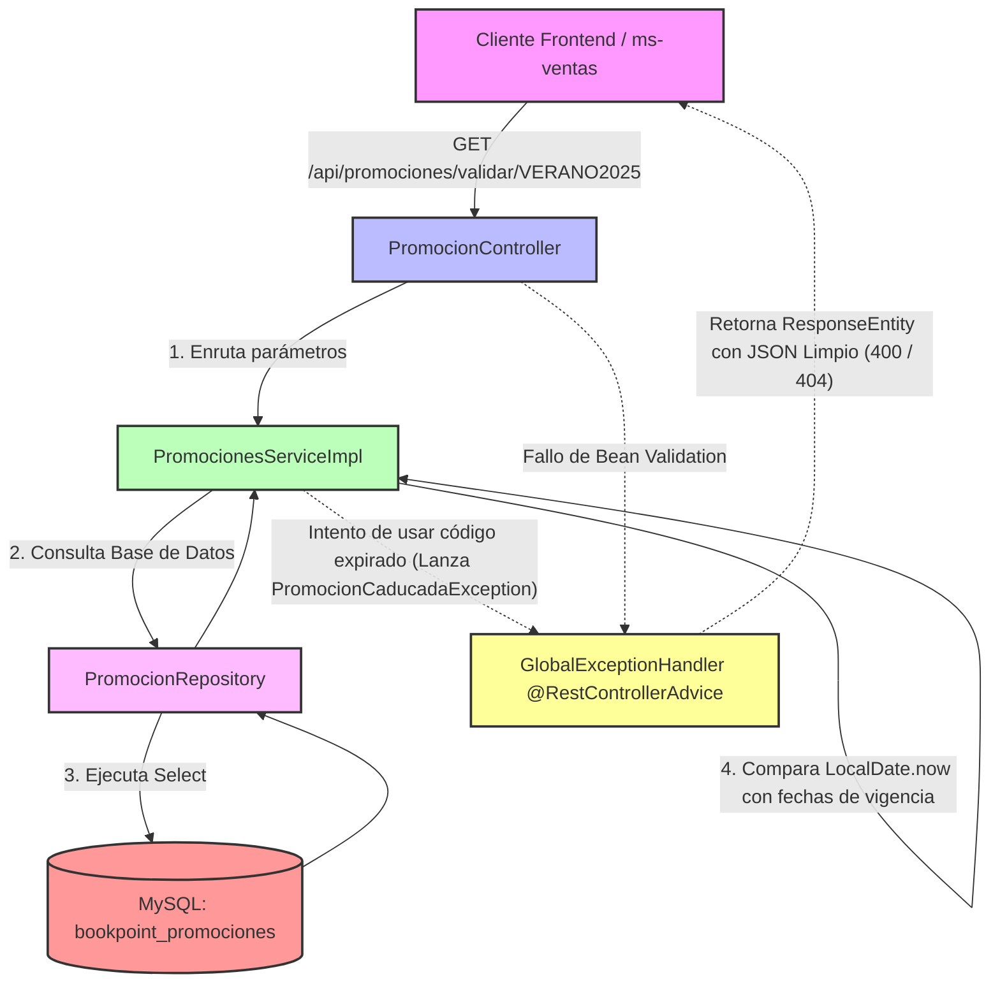

# Microservicio ms-promociones - BookPoint Chile
> **Área:** Motor de Reglas de Marketing, Cupones y Descuentos  
> **Arquitectura:** Microservicios con Spring Boot (Java 17) bajo Patrón CSR  
> **Puerto por Defecto:** `8087`

---

## 1. Visión General y Responsabilidades

El microservicio **`ms-promociones`** es el cerebro del motor de marketing y del control de descuentos dinámicos en la plataforma de **BookPoint Chile**. Su responsabilidad principal es gestionar e inyectar dinamismo comercial a las ventas a través de cupones y convenios promocionales globales, asegurando el cumplimiento de las siguientes reglas de negocio:

### Reglas de Negocio Críticas Controladas en la Capa Service:
*   **Vigencia Temporal Estricta:** Valida en tiempo real que el día en curso (`LocalDate.now()`) esté dentro del rango de vigencia de la promoción (`fechaInicio` y `fechaFin`). Si la fecha de hoy es previa al inicio o posterior al término, se bloquea la transacción.
*   **Filtro de Estado de Activación:** Las promociones deben estar configuradas explícitamente en estado `"ACTIVO"` para poder ser aplicadas a la compra.
*   **Índice de Unicidad Comercial:** Impide el registro de códigos duplicados (`codigo` único en base de datos) para evitar la superposición de porcentajes de descuento sobre el mismo alias.

---

## 2. Diagrama de Estructura e Intercepción de Errores (Mermaid)

El siguiente flujo detalla el comportamiento del microservicio bajo el patrón CSR, ilustrando la validación lógica de fechas en el servicio y la intercepción centralizada de excepciones:



---

## 3. Tecnologías Core e Implementación Técnica

*   **Spring Boot 3.2.5:** Framework principal del ecosistema del microservicio.
*   **Spring Data JPA (Hibernate):** Persistencia transaccional orientada a objetos mapeada a tablas MySQL.
*   **Consistencia Relacional:** Forzado del índice único `@Column(unique = true, nullable = false)` sobre el atributo `codigo` en la clase de dominio `Promocion`.
*   **JSR 380 (Bean Validation 3.0):** Emplea anotaciones en `CrearPromocionRequestDTO` para proteger la integridad de las campañas:
    *   `@NotBlank` para obligar al registro del código promocional.
    *   `@NotNull` y `@Min(1)` / `@Max(100)` en `porcentajeDescuento` para evitar márgenes de descuento en cero, negativos o superiores al 100%.
*   **SLF4J (Logback):** Integración mediante `@Slf4j` en `PromocionesServiceImpl` para registrar auditorías de cupones validados exitosamente (`log.info`) y emitir alertas preventivas (`log.warn`) ante intentos de validar cupones caducados o inexistentes.

---

## 4. Documentación de Endpoints REST

La API REST se encuentra completamente adaptada con CORS habilitado (`@CrossOrigin`) para la integración CSR y la interoperabilidad distribuida:

| Método HTTP | Endpoint | Descripción | Códigos HTTP de Respuesta |
| :--- | :--- | :--- | :--- |
| **POST** | `/api/promociones` | Registra una nueva campaña o cupón de descuento en la plataforma (`@Valid`). | `201 Created` (Éxito)<br>`400 Bad Request` (Descuento fuera de rango, campos vacíos)<br>`400 Bad Request` (Código ya existe) |
| **GET** | `/api/promociones` | Devuelve el catálogo histórico consolidado de todas las promociones del negocio. | `200 OK` (Éxito) |
| **GET** | `/api/promociones/validar/{codigo}` | **(Endpoint Core)** Valida síncronamente un código. Si está vigente, devuelve el DTO con su porcentaje de descuento. | `200 OK` (Válido)<br>`400 Bad Request` (Código caducado o inactivo)<br>`404 Not Found` (Código no existe) |

---

## 5. Pruebas de Integración (Postman Payloads)

### ✅ Happy Path: Registro Exitoso de una Nueva Campaña Promocional
*   **Método:** `POST`
*   **URL:** `http://localhost:8087/api/promociones`
*   **Body (JSON Raw):**
```json
{
  "codigo": "DESCUENTO25",
  "porcentajeDescuento": 25,
  "fechaInicio": "2026-05-01",
  "fechaFin": "2026-12-31"
}
```
*   **Efecto:** El sistema verificará que `DESCUENTO25` no exista. Al estar libre, persistirá el cupón con estado **ACTIVO** y responder con código **201 Created** y los datos del descuento registrado.

---

### ❌ Flujo de Error: Intento de Validar Cupón Caducado ("VERANO2025")
*   **Método:** `GET`
*   **URL:** `http://localhost:8087/api/promociones/validar/VERANO2025`
*   **Efecto:** El código `VERANO2025` fue sembrado en la base de datos con fecha de expiración `2025-03-31` (año anterior al curso actual). Al intentar validarlo, la capa de servicios detecta que ha expirado, cancela la solicitud, escribe un `log.warn` en consola y el `@RestControllerAdvice` responde con **HTTP 400 Bad Request** y el siguiente JSON estructurado:

```json
{
  "timestamp": "2026-05-24T18:45:10.987654",
  "status": 400,
  "error": "Bad Request - Marketing Rule Violation",
  "message": "La promoción con el código 'VERANO2025' ha caducado. Expiró el: 2025-03-31",
  "path": "/api/promociones/validar/VERANO2025",
  "details": null
}
```

---

## 6. Instrucciones de Ejecución

### Requisitos Previos:
1.  **Java JDK 17** en tu entorno.
2.  **Apache Maven 3.8+** instalado.
3.  **MySQL Server** configurado y en ejecución.

### Configuración del Entorno:
1.  Crea la base de datos `bookpoint_promociones` en tu MySQL local:
    ```sql
    CREATE DATABASE bookpoint_promociones;
    ```
2.  Configura las credenciales de conexión en [application.properties](src/main/resources/application.properties):
    ```properties
    spring.datasource.url=jdbc:mysql://localhost:3306/bookpoint_promociones?createDatabaseIfNotExist=true&useSSL=false&serverTimezone=UTC
    spring.datasource.username=root
    spring.datasource.password=tu_contraseña
    ```

### Sembrado Automático de Datos de Prueba (Boot Seeder):
El microservicio incorpora un sembrador inteligente `DataInitializer.java` que se ejecuta al arrancar. Si detecta la base de datos vacía, insertará automáticamente:
1.  **"CONVENIO_ESTUDIANTIL"** (15% de descuento, vigente para todo el año en curso).
2.  **"DESCUENTO10"** (10% de descuento, vigente para todo el año en curso).
3.  **"VERANO2025"** (20% de descuento, caducado el 31 de marzo de 2025 para pruebas de error).

### Ejecutar el Microservicio:
Abre una terminal en la raíz de `ms-promociones`  y ejecuta:

```bash
mvn clean spring-boot:run
```

El servicio iniciará en el puerto **`8087`**, gobernando las campañas y descuentos de la librería.
