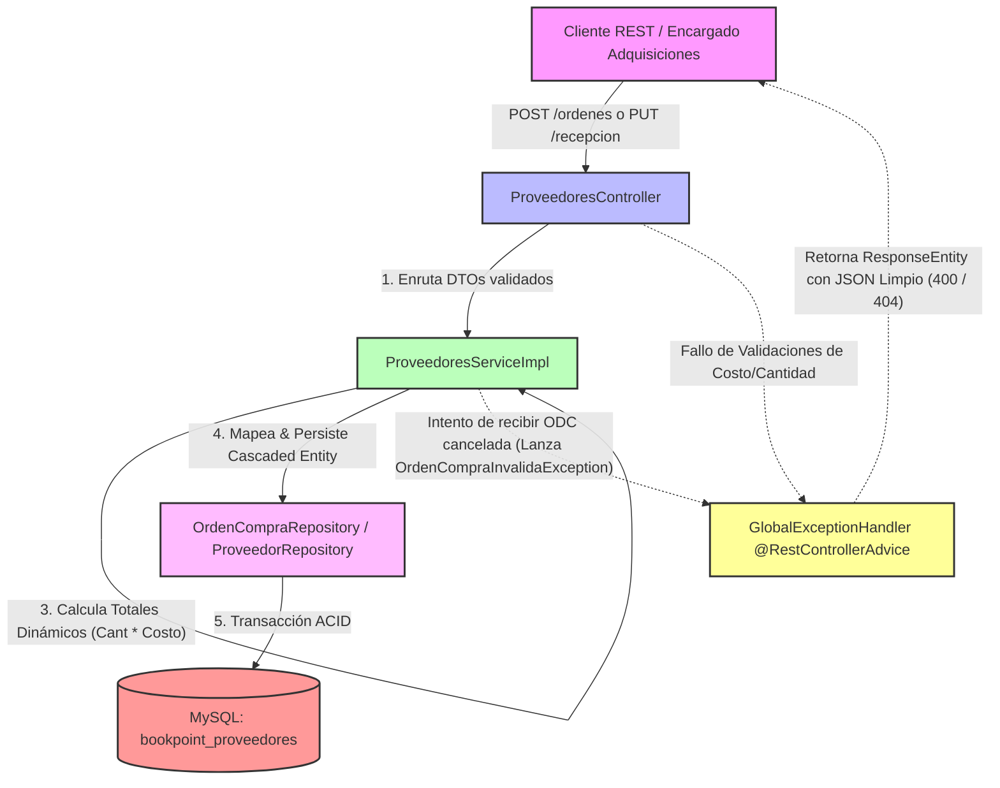

# Microservicio ms-proveedores - BookPoint Chile 
> **Área:** Gestión de Abastecimiento, Adquisiciones B2B y Órdenes de Compra (ODC)  
> **Arquitectura:** Microservicios con Spring Boot (Java 17) bajo Patrón CSR  
> **Puerto por Defecto:** `8086`

---

## 1. Visión General y Responsabilidades

El microservicio **`ms-proveedores`** es la espina dorsal del abastecimiento y las adquisiciones B2B en **BookPoint Chile**. Se encarga de gestionar de forma centralizada los contratos con editoriales y distribuidoras de papelería, emitir Órdenes de Compra (ODC) a proveedores y validar transaccionalmente el ingreso de mercaderías físicas para notificar a la bodega.

### Reglas de Negocio Críticas Controladas en la Capa Service:
*   **Cálculo Financiero Dinámico:** Para garantizar la inmutabilidad de los datos, el total de una ODC no se almacena en una columna estática de la base de datos. Se calcula dinámicamente en memoria en la capa de servicios al momento del mapeo (`subtotal = cantidadSolicitada * costoUnitario`), y se expone como un campo final en el DTO de respuesta.
*   **Seguridad Transaccional de Recepción:** Se restringe rigurosamente la recepción de mercadería si el estado de la ODC está en **CANCELADA** o ya fue **RECIBIDA** con anterioridad. Si la orden está cancelada, el servicio interrumpe el flujo, emite un aviso crítico con `log.warn` y arroja la excepción `OrdenCompraInvalidaException`.
*   **Unicidad del RUT del Proveedor:** Protege el registro de terceras partes obligando al RUT del proveedor a ser único antes de persistir en MySQL.

---

## 2. Diagrama de Estructura e Integración Transaccional (Mermaid)

El siguiente flujo detalla el comportamiento del microservicio bajo el patrón CSR, ilustrando cómo el servicio calcula los totales dinámicamente y protege la máquina de estados antes de persistir:



---

## 3. Tecnologías Core e Implementación Técnica

*   **Spring Boot 3.2.5:** Framework principal del ecosistema del microservicio.
*   **Spring Data JPA (Hibernate):** Persistencia física mapeada a entidades orientadas a objetos. Diseña una relación `@OneToMany(mappedBy = "ordenCompra", cascade = CascadeType.ALL, orphanRemoval = true)` en `OrdenCompra` y `@ManyToOne(fetch = FetchType.LAZY)` en `DetalleOrden` para asegurar un guardado en lote y borrado atómico.
*   **MySQL Constraints:** Garantiza robustez forzando índices únicos `@UniqueConstraint` para evitar RUTs duplicados en la tabla `proveedores`.
*   **JSR 380 (Bean Validation 3.0):** Emplea anotaciones en `DetalleOrdenRequestDTO` y `CrearProveedorRequestDTO` para proteger la integridad comercial:
    *   `@Min(1)` para evitar solicitudes de reposición vacías o de cantidad cero.
    *   `@Min(0)` para asegurar que el costo unitario del artículo no sea un valor negativo.
*   **SLF4J (Logback):** Integrado nativamente mediante `@Slf4j` en el `Service` para auditar la emisión de órdenes de compra (`log.info`) y emitir alertas críticas (`log.warn`) ante intentos de recepcionar mercadería rechazada o cancelada.

---

## 4. Documentación de Endpoints REST

La API REST cuenta con soporte total de CORS habilitado (`@CrossOrigin`) para integraciones con clientes CSR:

| Método HTTP | Endpoint | Descripción | Códigos HTTP de Respuesta |
| :--- | :--- | :--- | :--- |
| **GET** | `/api/proveedores` | Lista todos los proveedores (editoriales, papeleras) registrados en el ecosistema. | `200 OK` (Éxito) |
| **POST** | `/api/proveedores` | Registra una nueva entidad proveedora en el sistema, validando la unicidad del RUT. | `201 Created` (Éxito)<br>`400 Bad Request` (Datos incompletos)<br>`409 Conflict` (El RUT ya existe en BD) |
| **POST** | `/api/proveedores/ordenes` | Emite una Orden de Compra (ODC) detallando los artículos, cantidades y costos unitarios de reposición. | `201 Created` (Éxito)<br>`400 Bad Request` (Cantidad o costo negativo, ODC vacía)<br>`404 Not Found` (ID de proveedor no existe) |
| **PUT** | `/api/proveedores/ordenes/{id}/recepcion` | Registra que la mercadería llegó a Bodega. Protege e impide la recepción de ODCs que estén canceladas. | `200 OK` (Éxito)<br>`400 Bad Request` (La ODC está CANCELADA o RECIBIDA)<br>`404 Not Found` (ID de ODC no existe) |

---

## 5. Pruebas de Integración (Postman)

### ✅ Happy Path: Registro Exitoso de Emisión de Orden de Compra (ODC)
*   **Método:** `POST`
*   **URL:** `http://localhost:8086/api/proveedores/ordenes`
*   **Body (JSON Raw):**
```json
{
  "proveedorId": 1,
  "detalles": [
    {
      "productoId": 101,
      "cantidadSolicitada": 50,
      "costoUnitario": 15000.00
    },
    {
      "productoId": 102,
      "cantidadSolicitada": 10,
      "costoUnitario": 20000.00
    }
  ]
}
```
*   **Efecto:** El sistema localizará el proveedor con ID `1`. Registrará una ODC con estado **PENDIENTE** y asociará los dos detalles de productos, calculando el total dinámicamente ($750,000 + $200,000 = **$950,000**) y retornando un código **201 Created**.

---

### ❌ Flujo de Error: Intento de Recepción de una Orden de Compra CANCELADA
*   **Método:** `PUT`
*   **URL:** `http://localhost:8086/api/proveedores/ordenes/3/recepcion`
*   **Efecto:** La ODC con ID `3` fue sembrada con estado `CANCELADA` en el Data Seeder. Al intentar registrar su recepción en bodega, el servicio intercepta el estado no permitido, detiene el hilo transaccional, escribe un `log.warn` en consola y el `@RestControllerAdvice` (`GlobalExceptionHandler`) responde con **HTTP 400 Bad Request** y el siguiente JSON estructurado:

```json
{
  "timestamp": "2026-05-24T18:33:10.123456",
  "status": 400,
  "error": "Bad Request - ODC Rule Violation",
  "message": "No se puede registrar la recepción de mercadería de una orden de compra CANCELADA.",
  "path": "/api/proveedores/ordenes/3/recepcion",
  "details": null
}
```

---

## 6. Instrucciones de Ejecución

### Requisitos Previos:
1.  **Java JDK 17** en tu entorno.
2.  **Apache Maven 3.8+** instalado.
3.  **MySQL Server** configurado y en ejecución.

### Configuración del Entorno:
1.  Crea la base de datos `bookpoint_proveedores` en tu MySQL local:
    ```sql
    CREATE DATABASE bookpoint_proveedores;
    ```
2.  Configura las credenciales en el archivo [application.properties](src/main/resources/application.properties):
    ```properties
    spring.datasource.url=jdbc:mysql://localhost:3306/bookpoint_proveedores?createDatabaseIfNotExist=true&useSSL=false&serverTimezone=UTC
    spring.datasource.username=root
    spring.datasource.password=tu_contraseña
    ```

### Sembrado Automático de Datos de Prueba (Boot Seeder):
El microservicio incorpora un sembrador inteligente `DataInitializer.java` que se ejecuta al arrancar. Si detecta la base de datos vacía, insertará automáticamente:
*   Tres proveedores base: **Editorial Planeta Chilena S.A.**, **Penguin Random House** y **Distribuidora de Papelería Concepción**.
*   Tres Órdenes de Compra (ODC) de prueba en distintos estados (PENDIENTE, RECIBIDA, CANCELADA) con sus respectivos detalles para verificar de forma inmediata la integridad de las transacciones y endpoints en Postman.

### Ejecutar el Microservicio:
Abre una terminal en la raíz de `ms-proveedores` y ejecuta:

```bash
mvn clean spring-boot:run
```

El servicio iniciará en el puerto **`8086`**, listo para gestionar las compras corporativas B2B de la librería.
