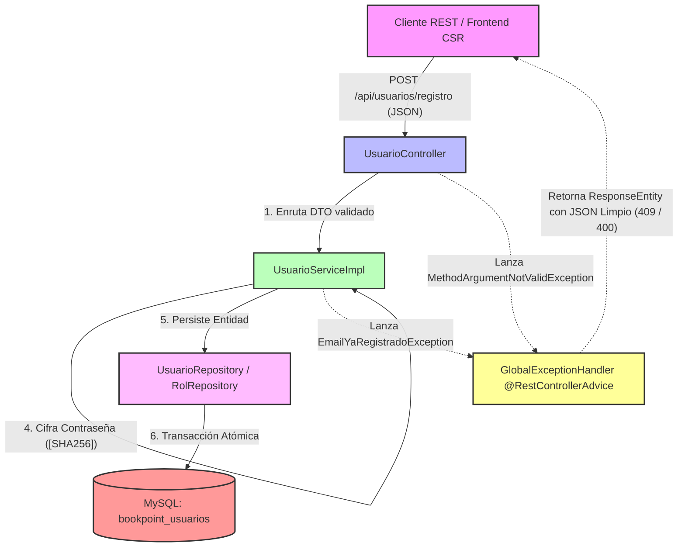

# Microservicio ms-usuarios - BookPoint Chile
> **Área:** Autenticación, Gestión de Identidades (IAM) y Roles  
> **Arquitectura:** Microservicios con Spring Boot (Java 17) bajo Patrón CSR  
> **Puerto por Defecto:** `8083`

---

## 1. Visión General y Responsabilidades

El microservicio **`ms-usuarios`** es el garante del control de acceso y el subsistema de Identidad y Accesos (IAM) de **BookPoint Chile**. Este microservicio es el encargado de autenticar a los diferentes actores del ecosistema y de definir de forma consistente los límites de operación de los cuatro perfiles exactos de la empresa:

1.  **Administrador del Sistema:** Administra usuarios y perfiles, modifica permisos y supervisa la operatividad del ecosistema técnico.
2.  **Jefe de Sucursal:** Modifica y administra al personal (cajeros, encargados de stock) pertenecientes a su sucursal física de trabajo.
3.  **Asistente de Ventas:** Personal de caja encargado de la venta física (consumidor de `ms-ventas`).
4.  **Cliente Web:** Usuario final que registra su cuenta en el e-commerce, compra online y califica libros.

### Reglas de Negocio Críticas Controladas en la Capa Service:
*   **Doble Unicidad Estricta:** Un usuario no puede registrarse con un `email` o un `rut` que ya existan en la base de datos centralizada.
*   **Asignación de Rol Inteligente:** Si en la petición de registro se omite el `rolId` (típico de un usuario registrándose de forma pública en la web), el servicio busca de forma automática el rol con el nombre exacto **"Cliente Web"** y lo asocia por defecto.
*   **Seguridad de Credenciales (Simulación de Hashing):** El microservicio intercepta la contraseña pura y la almacena con una máscara cifrada simulada (`[SHA256]`) para simular buenas prácticas y evitar almacenamiento plano de credenciales.

---

## 2. Diagrama de Estructura e Intercepción de Errores (Mermaid)

El siguiente flujo detalla el comportamiento del microservicio y cómo el `@RestControllerAdvice` centraliza e intercepta los errores del sistema antes de retornar al cliente frontend (CSR):



---

## 3. Tecnologías Core e Implementación Técnica

*   **Spring Boot 3.2.5:** Framework principal del ecosistema del microservicio.
*   **Spring Data JPA (Hibernate):** Persistencia física mapeada a entidades orientadas a objetos. Diseña una relación `@ManyToOne(fetch = FetchType.EAGER)` entre `Usuario` y `Rol`, debido a que el rol siempre debe estar en memoria para operaciones inmediatas de autorización.
*   **MySQL Constraints:** Garantiza robustez forzando índices únicos `@UniqueConstraint` para evitar correos y RUTs duplicados en la tabla `usuarios`.
*   **JSR 380 (Bean Validation 3.0):** Emplea anotaciones en `UsuarioRegistroRequestDTO` para proteger el formato de la entrada de datos:
    *   `@Email` para forzar un formato sintáctico de correo válido.
    *   `@NotBlank` en nombres, contraseñas y RUT.
    *   `@Size(min = 8)` para asegurar contraseñas con un mínimo de seguridad.
*   **SLF4J (Logback):** Uso de la anotación `@Slf4j` en la capa de servicios para registrar de manera clara la creación de cuentas exitosas (`log.info`) y emitir advertencias de seguridad (`log.warn`) ante intentos de registros con credenciales duplicadas.

---

## 4. Documentación de Endpoints REST

La API se encuentra completamente adaptada para la interoperabilidad del frontend web:

| Método HTTP | Endpoint | Descripción | Códigos HTTP de Respuesta |
| :--- | :--- | :--- | :--- |
| **POST** | `/api/usuarios/registro` | Registra una nueva cuenta en el sistema. Asigna de forma automática el rol "Cliente Web" si el campo `rolId` se omite. | `201 Created` (Éxito)<br>`400 Bad Request` (RUT vacío, contraseña < 8 caracteres, email inválido)<br>`409 Conflict` (Email o RUT ya existentes en BD) |
| **GET** | `/api/usuarios/{id}` | Recupera la información de perfil y de roles de un usuario específico. | `200 OK` (Éxito)<br>`404 Not Found` (El ID de usuario no existe) |
| **PUT** | `/api/usuarios/{id}/rol` | **(Acceso Admin)** Modifica el rol de un usuario existente (ej. promover de Asistente de Ventas a Jefe de Sucursal). | `200 OK` (Éxito)<br>`400 Bad Request` (Datos incompletos)<br>`404 Not Found` (Usuario o Rol inexistentes) |

---

## 5. Pruebas de Integración (Postman)

### ✅ Happy Path: Registro Exitoso de un Nuevo Cliente Web (Sin rolId)
*   **Método:** `POST`
*   **URL:** `http://localhost:8083/api/usuarios/registro`
*   **Body (JSON Raw):**
```json
{
  "rut": "18.987.654-3",
  "nombre": "Renato Duoc",
  "email": "renato@duoc.cl",
  "password": "miSuperClave123"
}
```
*   **Efecto:** El sistema verificará que el correo y el RUT no estén registrados. Al estar libres, asociará automáticamente el rol **"Cliente Web"**, guardará el registro cifrando la contraseña (`[SHA256]miSuperClave123`) y responderá con un código **201 Created**.

---

### ❌ Flujo de Error: Intento de Registro con Email Duplicado (Fallo 409 Conflict)
*   **Método:** `POST`
*   **URL:** `http://localhost:8083/api/usuarios/registro`
*   **Body (JSON Raw):**
```json
{
  "rut": "20.123.456-7",
  "nombre": "Administrador Clon",
  "email": "admin@bookpoint.cl",
  "password": "claveAdministrador"
}
```
*   **Efecto:** El correo `admin@bookpoint.cl` fue sembrado en el arranque del sistema. La capa `Service` identificará el correo duplicado, cancelará la transacción, registrará un `log.warn` en consola y el `@RestControllerAdvice` (`GlobalExceptionHandler`) retornará un estado **HTTP 409 Conflict** con el siguiente JSON estructurado:

```json
{
  "timestamp": "2026-05-24T17:43:10.987654",
  "status": 409,
  "error": "Conflict",
  "message": "El correo electrónico 'admin@bookpoint.cl' ya se encuentra registrado.",
  "path": "/api/usuarios/registro",
  "details": null
}
```

---

## 6. Instrucciones de Ejecución

### Requisitos Previos:
1.  **Java JDK 17** en tu entorno.
2.  **Apache Maven 3.8+** instalado.
3.  **MySQL Server** en ejecución.

### Configuración del Entorno:
1.  Crea la base de datos `bookpoint_usuarios` en tu MySQL:
    ```sql
    CREATE DATABASE bookpoint_usuarios;
    ```
2.  Configura las credenciales de conexión en [application.properties](src/main/resources/application.properties):
    ```properties
    spring.datasource.url=jdbc:mysql://localhost:3306/bookpoint_usuarios?createDatabaseIfNotExist=true&useSSL=false&serverTimezone=UTC
    spring.datasource.username=root
    spring.datasource.password=tu_contraseña
    ```

### Sembrado Automático Base (Data Seeder):
El microservicio incorpora un sembrador inteligente `DataInitializer.java` que se ejecuta al arrancar. Si detecta la base de datos vacía, insertará automáticamente:
1.  Los 4 roles de la empresa: **Administrador del Sistema**, **Jefe de Sucursal**, **Asistente de Ventas** y **Cliente Web**.
2.  Una cuenta administradora de pruebas lista para usar:
    *   **Email:** `admin@bookpoint.cl`
    *   **Contraseña:** `admin1234`
    *   **Rol:** Administrador del Sistema

### Ejecutar el Microservicio:
Abre una terminal en la raíz de `ms-usuarios`  y ejecuta:

```bash
mvn clean spring-boot:run
```

El servicio iniciará en el puerto **`8083`**, listo para gobernar los accesos de la aplicación.
